# 🔄 Cyclic Research Agent

A sophisticated autonomous research system built with **LangGraph** that iteratively gathers, evaluates, and synthesizes information until research quality standards are met.

## 🏗️ Architecture Overview

This is **not a linear pipeline**—it's a **state machine** that loops until the research is complete.

```mermaid
graph TD
    Start([User Query]) --> Planner[🧠 Planner Node<br/>Breaks query into sub-questions]
    Planner --> Researcher[🔍 Researcher Node<br/>Searches & scrapes web]
    Researcher --> Critic[🎯 Critic Node<br/>Evaluates quality]
    
    Critic -->|Research Incomplete| Planner
    Critic -->|Research Complete| Writer[📝 Writer Node<br/>Generates final report]
    Writer --> End([✅ Markdown Report])
    
    style Planner fill:#e1f5ff
    style Researcher fill:#fff4e1
    style Critic fill:#ffe1f5
    style Writer fill:#e1ffe1
```



### 🧠 The Four Nodes

#### 1. **Planner** (Manager)
- **Input**: User query or critique feedback
- **Action**: Breaks query into 3-5 specific, researchable sub-questions
- **Output**: JSON array of sub-questions
- **Example**: 
  ```json
  [
    "What are the main types of solid-state electrolytes?",
    "Which companies are leading solid-state battery development in 2024?",
    "What are the current challenges in commercial production?"
  ]
  ```

#### 2. **Researcher** (Worker)
- **Action**: For each sub-question:
  1. Uses **Tavily Search** to gather information
  2. Analyzes if results are sufficient
  3. If vague → triggers **WebBaseLoader** to scrape full content
- **Output**: Accumulated notes with summaries and sources
- **Smart Logic**: Only scrapes when search snippets are insufficient

#### 3. **Critic** (Quality Control)
- **Action**: Evaluates completeness of gathered research
- **Decision Logic**:
  - ✅ Information complete → Proceed to Writer
  - ⚠️ Gaps detected → Loop back to Planner with specific feedback
- **Safety**: Max 3 iterations to prevent infinite loops
- **Output**: Critique feedback or approval

#### 4. **Writer** (Publisher)
- **Action**: Synthesizes all research notes into a comprehensive report
- **Output**: Professional Markdown document with:
  - Executive Summary
  - Key Findings
  - Detailed Analysis
  - Citations with URLs
  - Conclusion

---

## 🚀 Quick Start

### Prerequisites

```bash
Python 3.10+
pip install -r requirements.txt
```

### API Keys Setup

Create a `.env` file in the project root:

```env
GOOGLE_API_KEY=your_google_api_key_here
TAVILY_API_KEY=your_tavily_api_key_here
```

**Get API Keys:**
- **Google Gemini**: [https://makersuite.google.com/app/apikey](https://makersuite.google.com/app/apikey)
- **Tavily Search**: [https://tavily.com](https://tavily.com) (Free tier: 1000 searches/month)

### Installation

```bash
# Clone or download the project
git clone <your-repo-url>
cd cyclic-research-agent

# Install dependencies
pip install -r requirements.txt

# Create .env file with your API keys
echo "GOOGLE_API_KEY=your_key" >> .env
echo "TAVILY_API_KEY=your_key" >> .env
```

### Run the Agent

```bash
python research_agent.py
```

**Customize the query** in `research_agent.py`:

```python
if __name__ == "__main__":
    query = "Your research question here"
    report = run_research(query)
```

---

## 📊 State Management

The agent uses a **shared state dictionary** that flows through all nodes:

```python
class ResearchState(TypedDict):
    query: str                    # Original user query
    plan: List[str]               # List of sub-questions
    notes: List[dict]             # Accumulated research (grows over iterations)
    iteration: int                # Current loop count
    critique: str                 # Feedback from critic
    final_report: str             # Final markdown output
    should_continue: bool         # Loop control flag
```

---

## 🔄 Execution Flow Example

### Iteration 1
```
🧠 PLANNER: Creates 5 sub-questions
   ↓
🔍 RESEARCHER: Searches for each, scrapes 2 websites
   ↓
🎯 CRITIC: "Missing cost analysis and commercialization timeline"
   ↓ (Loop back)
```

### Iteration 2
```
🧠 PLANNER: Adds 2 new questions about costs & timeline
   ↓
🔍 RESEARCHER: Gathers additional data
   ↓
🎯 CRITIC: "Research complete!"
   ↓
📝 WRITER: Generates final report → research_report.md
```

---

## 🎯 Key Features

### ✅ Adaptive Planning
- Initial plan from user query
- Iterative refinement based on critic feedback

### ✅ Intelligent Web Scraping
- Only scrapes when search results are insufficient
- Prevents unnecessary API calls

### ✅ Quality Assurance
- Built-in critic validates completeness
- Prevents premature report generation

### ✅ Safety Mechanisms
- Max 3 iterations to prevent infinite loops
- Error handling for failed searches/scrapes

### ✅ Structured Output
- Professional Markdown reports
- Citations with source URLs
- Organized by themes

---

## 🛠️ Customization

### Change LLM Model

```python
# Switch to different Gemini models
llm = ChatGoogleGenerativeAI(model="gemini-pro")  # Standard
llm = ChatGoogleGenerativeAI(model="gemini-2.0-flash-exp")  # Fastest
```

### Adjust Search Results

```python
search_tool = TavilySearch(max_results=5)  # Get more results
```

### Modify Iteration Limit

```python
# In critic_node()
is_complete = critique["is_complete"] or iteration >= 5  # Allow 5 iterations
```

---

## 📁 Project Structure

```
cyclic-research-agent/
│
├── research_agent.py          # Main agent implementation
├── .env                        # API keys (not committed)
├── requirements.txt            # Python dependencies
├── README.md                   # This file
└── research_report.md          # Generated output (created after run)
```

---

## 🧪 Example Queries

```python
# Technology Research
"Latest advancements in solid-state batteries in 2024"

# Market Analysis
"Current state of quantum computing commercialization"

# Scientific Review
"Recent breakthroughs in CRISPR gene editing techniques"

# Business Intelligence
"Major mergers and acquisitions in AI companies during 2024"
```

---


**Happy Researching! 🚀**
